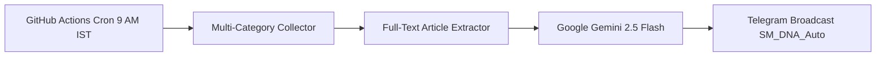

# ?? Daily AI-Powered News Intelligence Pipeline

[](https://github.com/SagarMohanty2020/daily-ai-news-intelligence/actions/workflows/daily_news_digest.yml)
[](https://github.com/SagarMohanty2020)
[](https://opensource.org/licenses/MIT)
[](https://www.python.org/)

An automated, serverless intelligence engine that aggregates multi-domain global and domestic news, extracts full-text articles to **eliminate AI hallucinations**, performs structured synthesis with sentiment and impact analysis via **Google Gemini 2.5 Flash**, and broadcasts an **Executive Morning Briefing** to the **SM_DNA_Auto** Telegram channel.

---

## ?? Key Highlights

- **Multi-Category Ingestion**: Scrapes curated feeds across **Financial & Markets**, **Technology & AI**, **Geopolitics & World**, **Pharma & Healthcare**, and **Social & Governance**.
- **Zero-Hallucination Full-Text Parsing**: Uses `trafilatura` to extract real article bodies from the web, stripping out ads, cookies, and fluff before LLM inference.
- **AI-Powered Synthesis**: Leverages Google Gemini 2.5 Flash (`google-genai` SDK) to generate concise bullet points, strategic takeaways, market sentiment (Bullish/Bearish/Neutral), and impact ratings.
- **Serverless Automation**: Fully orchestrated via **GitHub Actions** running on a daily cron at **9:00 AM IST** (3:30 AM UTC) for **100% free operation**.
- **Telegram Broadcasting**: Delivers an HTML-formatted executive brief to the `@SM_DNA_Auto` Telegram channel with automated message chunking (<4000 characters).

---

## ??? Architecture



---

## ?? Setup & Configuration

### 1. Prerequisites & API Keys
1. **Google Gemini API Key**: Get a free API key from [Google AI Studio](https://aistudio.google.com/).
2. **Telegram Bot Token**: Create a bot using [@BotFather](https://t.me/BotFather) on Telegram and copy the bot token.
3. **Telegram Channel**: Create a Telegram channel (e.g. `SM_DNA_Auto`), add your bot as an **Administrator** with permission to post messages.

### 2. Configure GitHub Secrets
In your GitHub repository, go to **Settings** > **Secrets and variables** > **Actions** and add the following repository secrets:

| Secret Name | Description | Example |
|---|---|---|
| `GEMINI_API_KEY` | Google AI Studio API Key | `AIzaSy...` |
| `TELEGRAM_BOT_TOKEN` | Telegram Bot Token from BotFather | `123456789:ABCdef...` |
| `TELEGRAM_CHAT_ID` | Telegram Channel handle or Chat ID | `SM_DNA_Auto` |

---

## ?? Local Development

```bash
# 1. Clone repository
git clone https://github.com/SagarMohanty2020/daily-ai-news-intelligence.git
cd daily-ai-news-intelligence

# 2. Set up virtual environment
python -m venv .venv
source .venv/bin/activate  # On Windows: .venv\Scripts\activate

# 3. Install dependencies
pip install -r requirements.txt

# 4. Configure local environment variables
cp .env.example .env
# Edit .env with your GEMINI_API_KEY and TELEGRAM credentials

# 5. Run pipeline locally
python main.py
```

---

## ?? Testing

Run automated tests using pytest:

```bash
pytest tests/ -v
```

---

## ?? Author
**Sagar Mohanty**  
GitHub: [@SagarMohanty2020](https://github.com/SagarMohanty2020)
